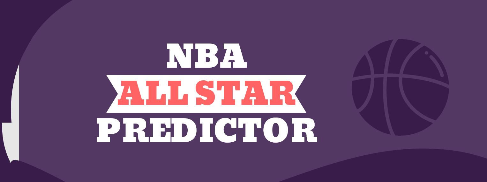
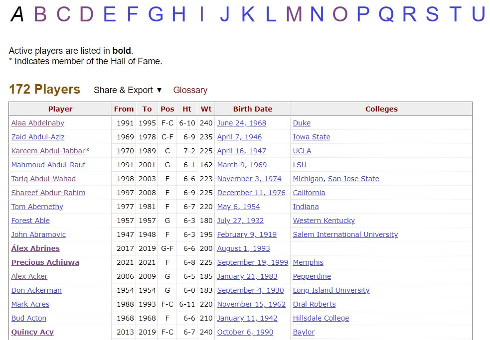
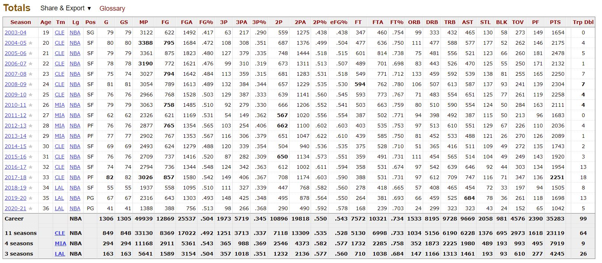
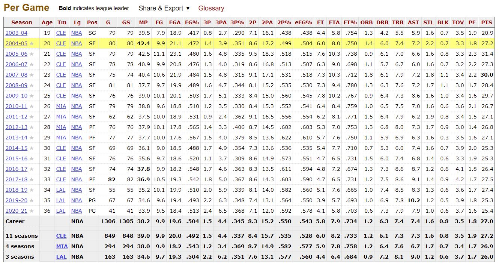
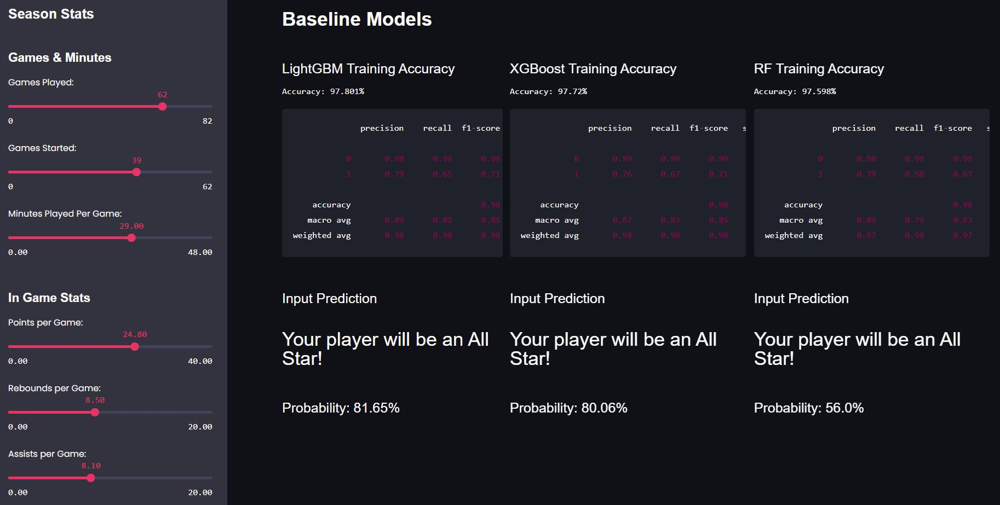

# NBA All Star Predictor

## Project Description
- A personal project to explore scraping and basic machine learning.
- Big Question: Which players were all-stars? 
- Assumption: taking full season stats instead of stats up till all-star break.

## App Deployment
Link to App: [NBA All Star Predictor](https://share.streamlit.io/ahhhlexli/basketball_reference_scrape/app_model_only.py "All Star Predictor")
- Hosted on Streamlit Share
## Data Source

- NBA Player Season Totals taken off [Basketball-Reference.com](https://www.basketball-reference.com/ "Basketball Reference")
- Scraped Data Includes:
  - Player List from 1996 - Present
  - Individual season stats totals
  - Individual season per game stats

### Sample Data

Player List

Season Totals

Per Game

## Modelling
### Models Compared

> LightGBM Classifier  
> Random Forest Classifier  
> XGBoost Classifier

## Deployment

- Deployed on Streamlit
- Use sidebar to input player's stats
- Predictions presented from all three classifiers

## Coding Language & Main Libraries

- Python Version 3.8.3
- Pandas Version 1.2.2
- Scikit-learn 0.23.2
- Streamlit 0.78.0

