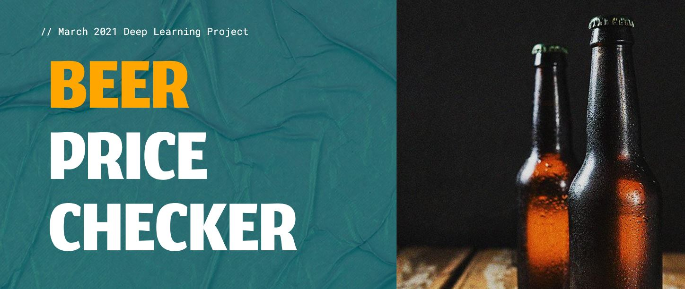
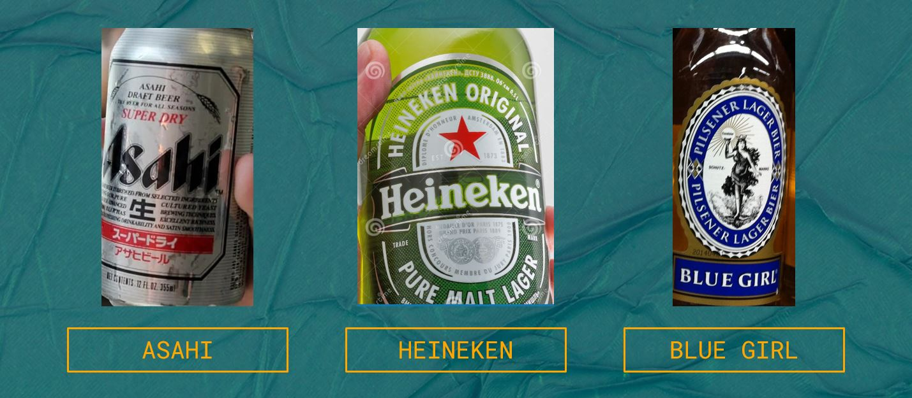
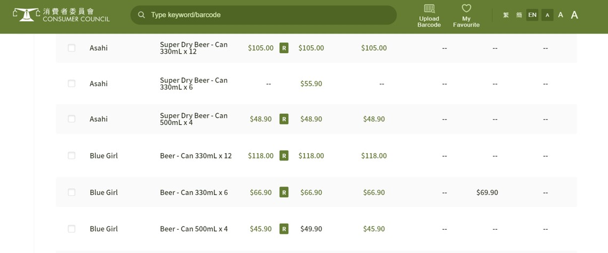
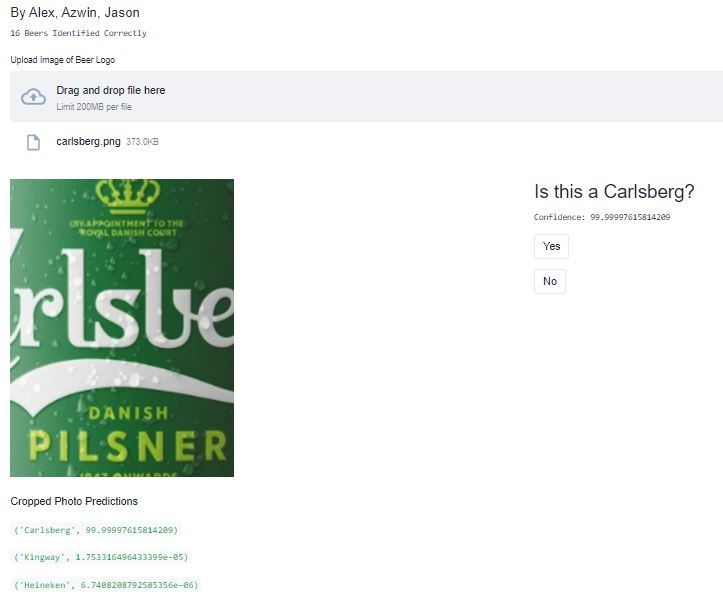
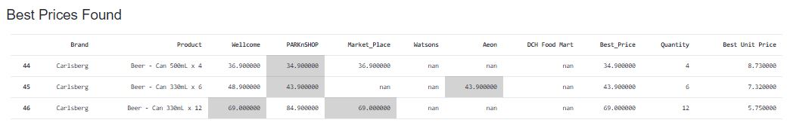

## Group Project Members

[Alex Li](https://github.com/ahhhlexli "Alex Li's GitHub")\
[Azwin Lam](https://github.com/azwinlam "Azwin Lam's GitHub")\
[Jason Lee](https://github.com/lhwj0619 "Jason Lee's GitHub")

# Objective

- Create a deployable application that enables a quick and effective method for checking & comparing retail prices of beers from supermarkets

# Data Sources 
## Overview

- 3500+ images of beer bottles and cans with their logos 
  - Google Images 
- 18 brands of beer found from Consumer Council Price Watch website 
  - https://online-price-watch.consumer.org.hk/opw/

### Beer Image Samples



### Consumer Council Data Sample


# Data Cleaning
### Beer Images
- Images were generally not zoomed in enough on the logos
- Used Inbac for clean and efficient image cropping
   - https://github.com/weclaw1/inbac
### Price Data
- Basic reformatting of the dataframe through Pandas for improved ease of use  
<p>&nbsp;</p>
 

# Modelling
- Model done using Tensorflow CNN
- Baseline model accuracy ~85%
- Final model accuracy ~98%

### Finalised Model Structure
```
model = tf.keras.Sequential([data_augmentation])
model.add(Conv2D(input_shape=(img_height,img_width,3),filters=64,kernel_size=(3,3),padding="same", activation="relu", kernel_regularizer=regularizers.l1_l2(l1=1e-5, l2=1e-4)))
model.add(MaxPooling2D(pool_size=2,)) 
model.add(Dropout(0.2))
model.add(Conv2D(kernel_size = 2, filters = 64, activation='relu', kernel_regularizer=regularizers.l1_l2(l1=1e-5, l2=1e-4)))
model.add(Conv2D(kernel_size = 2, filters = 64, activation='relu', kernel_regularizer=regularizers.l1_l2(l1=1e-5, l2=1e-4)))
model.add(MaxPooling2D(pool_size=2))
model.add(Dropout(0.2))
model.add(Conv2D(kernel_size = 2, filters = 128, activation='relu', kernel_regularizer=regularizers.l1_l2(l1=1e-5, l2=1e-4)))
model.add(Conv2D(kernel_size = 2, filters = 128, activation='relu', kernel_regularizer=regularizers.l1_l2(l1=1e-5, l2=1e-4)))
model.add(MaxPooling2D(pool_size=2))
model.add(Dropout(0.2))
model.add(Conv2D(kernel_size = 2, filters = 256, activation='relu', kernel_regularizer=regularizers.l1_l2(l1=1e-5, l2=1e-4)))
model.add(Conv2D(kernel_size = 2, filters = 256, activation='relu', kernel_regularizer=regularizers.l1_l2(l1=1e-5, l2=1e-4)))
model.add(MaxPooling2D(pool_size = 2))
model.add(Dropout(0.2))
model.add(GlobalMaxPooling2D())
model.add(Dense(num_classes, activation = 'softmax', kernel_regularizer=regularizers.l1_l2(l1=1e-5, l2=1e-4)))
```


# Deployment / Production
- Deployed using Streamlit, hosted with Google Cloud Platform VM
- VM Link to App: **[Beer Price Checker](https://tinyurl.com/beerpricechecker "Beer Price Checker")**
  - Live deployment until end of June 
- Streamlit Share Link to App: **[Beer Price Checker](https://share.streamlit.io/ahhhlexli/beer-price-checker/main/streamlitshare_main.py "Beer Price Checker")** 
- User uploaded photo will output a prediction and display retail prices for the predicted brand

### Sample Data Input

### Sample Data Output

# Future Improvements 
- Expand existing dataset 
  - Include more beer brands
  - Larger selection of grocery categories (eg. chips, cleaning products)
  - More price sources
- Improve recognition ability of model
  - Expand capabilities to predict poorly taken photographs
- UI development
  - More user friendly way to filter returned results
  - Improve the overall visual experience

# Coding Language & Main Libraries

**Python Version:**  
Python 3.7.10 (Google Colab)

**Main Libraries Used:**  
Tensorflow 2.4.1  
Inbac 2.1.0  
Opencv-python  4.1.2  
Streamlit 0.78.0


