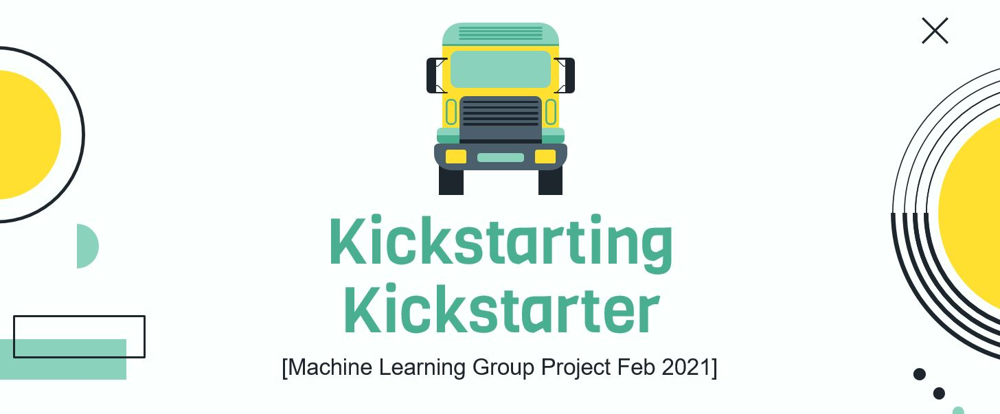
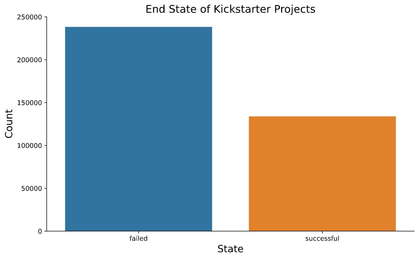
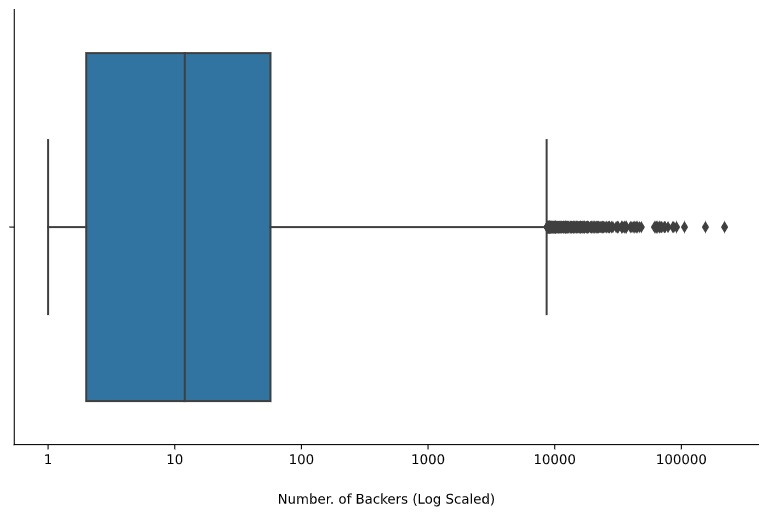
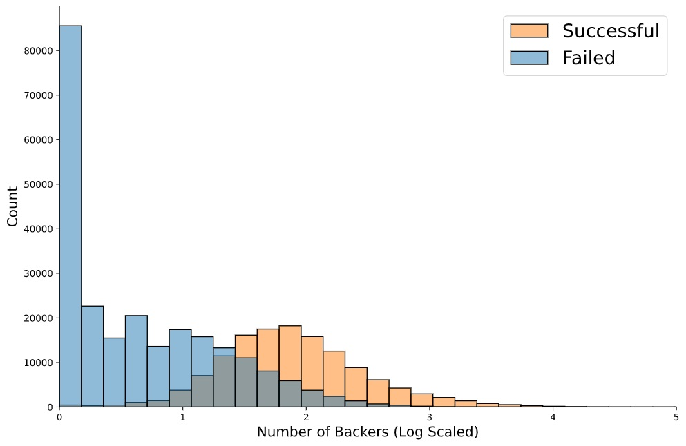
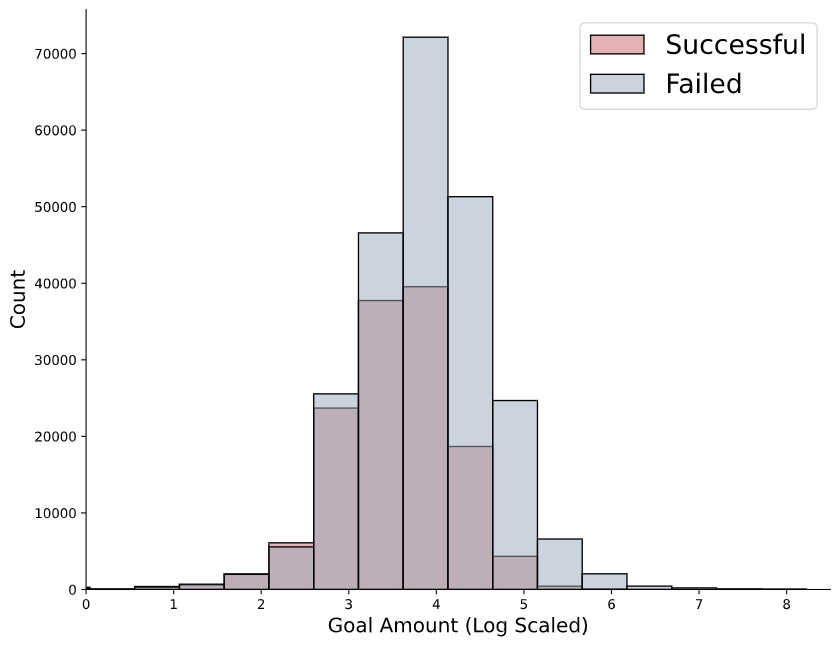
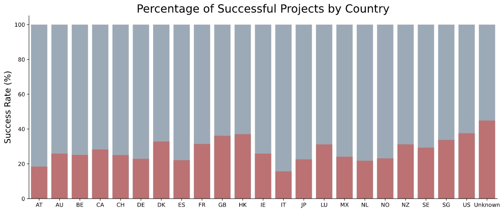
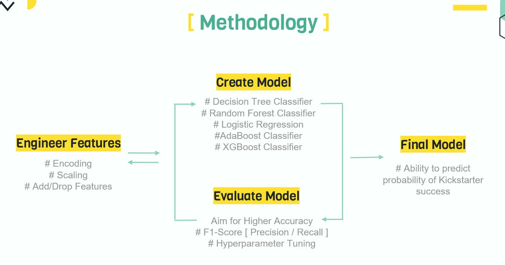
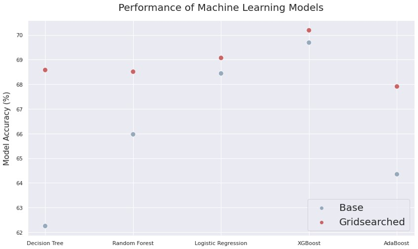

# Objective
- Use machine learning models to predict which Kickstarter Projects will be successful
# Data Sources
- Data found from Kaggle
- [Source Data](https://www.kaggle.com/kemical/kickstarter-projects)  

### Sample Data
|    |         ID | name                                                       | category       | main_category   | currency   | deadline   |   goal | launched            |   pledged | state    |   backers | country   |   usd pledged |   usd_pledged_real |   usd_goal_real |
|---:|-----------:|:-----------------------------------------------------------|:---------------|:----------------|:-----------|:-----------|-------:|:--------------------|----------:|:---------|----------:|:----------|--------------:|-------------------:|----------------:|
|  0 | 1000002330 | The Songs of Adelaide & Abullah                            | Poetry         | Publishing      | GBP        | 2015-10-09 |   1000 | 2015-08-11 12:12:28 |         0 | failed   |         0 | GB        |             0 |                  0 |         1533.95 |
|  1 | 1000003930 | Greeting From Earth: ZGAC Arts Capsule For ET              | Narrative Film | Film & Video    | USD        | 2017-11-01 |  30000 | 2017-09-02 04:43:57 |      2421 | failed   |        15 | US        |           100 |               2421 |        30000    |
|  2 | 1000004038 | Where is Hank?                                             | Narrative Film | Film & Video    | USD        | 2013-02-26 |  45000 | 2013-01-12 00:20:50 |       220 | failed   |         3 | US        |           220 |                220 |        45000    |
|  3 | 1000007540 | ToshiCapital Rekordz Needs Help to Complete Album          | Music          | Music           | USD        | 2012-04-16 |   5000 | 2012-03-17 03:24:11 |         1 | failed   |         1 | US        |             1 |                  1 |         5000    |
|  4 | 1000011046 | Community Film Project: The Art of Neighborhood Filmmaking | Film & Video   | Film & Video    | USD        | 2015-08-29 |  19500 | 2015-07-04 08:35:03 |      1283 | canceled |        14 | US        |          1283 |               1283 |        19500    |
# Data Cleaning

- Regrouped the states of the projects to reflect only **successful** or **failed**
  - 'Canceled' & 'Suspended' considered as **failed**
  - 'Undefined' values dropped
- Renamed countries labelled as **N,0"** to **Unknown**
- Converted launch and deadline dates to datetime format

# Exploratory Data Analysis

### Insights from the Data
- 2/3 of all projects fail. Success rate is ~33%.

- Median Number of backers for a Kickstarter project is 12 backers. 
- 75% of projects under 100 backers

- Most failed projects have very few backers.
- The more backers a project has, the higher the frequency of success.

- Setting realistic goal amounts is important. Having goal amounts that are too high means they are hard to achieve.

- Success rate is relatively even between countries. No one country has a success rate over 40% (excluding 'Unknown' category).

# Modelling
## Models Compared

> Decision Tree Classifier  
> Logistic Regression  
> Random Forest Classifier  
> KNN Classifier  
> AdaBoost Classifier  
> XGBoost Classifier

## Key Evaluation Factors

> Accuracy Score  
> F1 Score  
> Precision  
> Recall

## Methodology

## Sample Methodology for a Model 

#### Baseline Model & Make Predictions
> model = LogisticRegression()  
> model.fit(X_train, y_train)  
> predictions = model.predict(X_test)

#### Evaluate Using Confusion Matrix
> tn, fp, fn, tp = confusion_matrix(y_test, predictions).ravel()
print('Confusion Matrix')
print([tp,fp])
print([fn,tn])
print()  
> print('Classification Report')  
> print(classification_report(y_test, predictions))  
> print('Accuracy Score')  
> print(accuracy_score(y_test, predictions))

#### Parameter Tuning
> parameters = {'C':np.linspace(.01,1)}  
> search = GridSearchCV(LogisticRegression(), parameters, verbose=3, n_jobs=-1)  
> search.fit(X_train, y_train)  
> print('LOGISTIC REGRESSION - GRID SEARCH')  
> print(search.best_score_)  
> print(search.best_params_)

#### Tuned Model & Make Predictions
> model = LogisticRegression(max_iter=1000, C=0.5555102040816327)  
> model.fit(X_train, y_train)  
> predictions = model.predict(X_test)

#### Final Evaluation using Confusion Matrix
> tn, fp, fn, tp = confusion_matrix(y_test, predictions).ravel()
print('Confusion Matrix')
print([tp,fp])
print([fn,tn])
print()  
> print('Classification Report')  
> print(classification_report(y_test, predictions))  
> print('Accuracy Score')  
> print(accuracy_score(y_test, predictions))

# Findings

- XGBoost Classifier helped create the best predictive model
  - Highest accuracy score in comparison to other models tested (~70% vs ~68-69%)
  - Best F1-score (0.50 vs 0.15-0.45)

# Future Improvements
- Expand dataset & extended feature engineering
  - Project Descriptions
  - Returning Kickstarters
  - Stretch Goals
  - Social Media Presence

- Explore using additional models
  - Use of Neural Networks
  - SVM
  - KNN

# Coding Language & Main Libraries

- Python Version 3.8.3
- Pandas Version 1.2.2
- Scikit-learn Version 0.23.2
- Seaborn Version 0.11.1

# Team Members
> Alex Li  
> Hancock  
> Hui-ee
