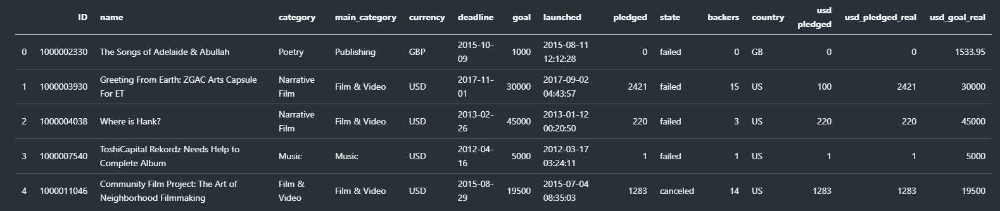

# Objective
- Use machine learning models to predict which Kickstarter Projects will be successful

# Data Sources
- Data found from Kaggle
- [Source Data](https://www.kaggle.com/kemical/kickstarter-projects)  


### Sample Data



# Data Cleaning

- Regrouped the states of the projects to reflect only **successful** or **failed**
  - 'Canceled' & 'Suspended' considered as **failed**
  - 'Undefined' values dropped
- Renamed countries labelled as **N,0"** to **Unknown**
- Converted launch and deadline dates to datetime format

# Exploratory Data Analysis

### Insights from the Data
- 2/3 of all projects fail. Success rate is ~33%.


- Median Number of backers for a Kickstarter project is 12 backers. 
- 75% of projects under 100 backers


- Most failed projects have very few backers.
- The more backers a project has, the higher the frequency of success.


- Setting realistic goal amounts is important. Having goal amounts that are too high means they are hard to achieve.


- Success rate is relatively even between countries. No one country has a success rate over 40% (excluding 'Unknown' category).


# Modelling
## Models Compared

> Decision Tree Classifier  
> Logistic Regression  
> Random Forest Classifier  
> KNN Classifier  
> AdaBoost Classifier  
> XGBoost Classifier

## Key Evaluation Factors

> Accuracy Score  
> F1 Score  
> Precision  
> Recall

## Methodology


## Sample Methodology for a Model 

#### Baseline Model & Make Predictions
```
model = LogisticRegression()  
model.fit(X_train, y_train)  
predictions = model.predict(X_test)
```
#### Evaluate Using Confusion Matrix
```
tn, fp, fn, tp = confusion_matrix(y_test, predictions).ravel()
print('Confusion Matrix')
print([tp,fp])
print([fn,tn])
print()  
print('Classification Report')  
print(classification_report(y_test, predictions))  
print('Accuracy Score')  
print(accuracy_score(y_test, predictions))
```

#### Parameter Tuning
```
parameters = {'C':np.linspace(.01,1)}  
search = GridSearchCV(LogisticRegression(), parameters, verbose=3, n_jobs=-1)  
search.fit(X_train, y_train)  
print('LOGISTIC REGRESSION - GRID SEARCH')  
print(search.best_score_)  
print(search.best_params_)
```

#### Tuned Model & Make Predictions
```
model = LogisticRegression(max_iter=1000, C=0.5555102040816327)  
model.fit(X_train, y_train)  
predictions = model.predict(X_test)
```

#### Final Evaluation using Confusion Matrix
```
tn, fp, fn, tp = confusion_matrix(y_test, predictions).ravel()
print('Confusion Matrix')
print([tp,fp])
print([fn,tn])
print()  
print('Classification Report')  
print(classification_report(y_test, predictions))  
print('Accuracy Score')  
print(accuracy_score(y_test, predictions))
```

# Findings


- XGBoost Classifier helped create the best predictive model
  - Highest accuracy score in comparison to other models tested (~70% vs ~68-69%)
  - Best F1-score (0.50 vs 0.15-0.45)


# Future Improvements
- Expand dataset & extended feature engineering
  - Project Descriptions
  - Returning Kickstarters
  - Stretch Goals
  - Social Media Presence

- Explore using additional models
  - Use of Neural Networks
  - SVM
  - KNN

# Coding Language & Main Libraries

- Python Version 3.8.3
- Pandas Version 1.2.2
- Scikit-learn Version 0.23.2
- Seaborn Version 0.11.1


# Team Members
> Alex Li  
> Hancock  
> Hui-ee
